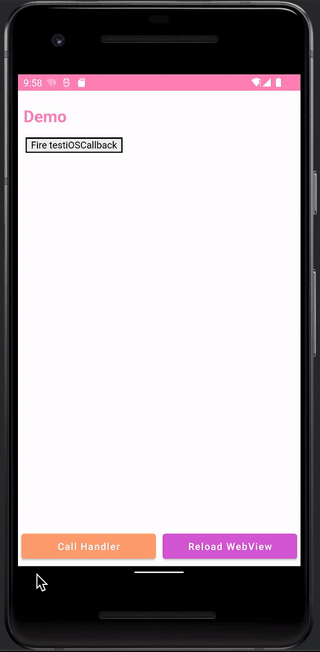

# JsBridge

[](https://jitpack.io/#laole918/JsBridge)

> This project is inspired by [marcuswestin/WebViewJavascriptBridge](https://github.com/marcuswestin/WebViewJavascriptBridge) and [Lision/WKWebViewJavascriptBridge](https://github.com/Lision/WKWebViewJavascriptBridge)!

iOS Obj-C : [https://github.com/laole918/WKWebViewJavascriptBridge](https://github.com/laole918/WKWebViewJavascriptBridge)

# What Can JsBridge Do?

You can write hybrid modules in just a few lines of code by using JsBridge without the need to be concerned with the underlying messaging implementation.



# Features

- **Multi-end Consistency:** This Android version project is a mirror of [marcuswestin/WebViewJavascriptBridge](https://github.com/marcuswestin/WebViewJavascriptBridge)(Obj-C) and [Lision/WKWebViewJavascriptBridge](https://github.com/Lision/WKWebViewJavascriptBridge)(Swift), so they have the same API design, native code, and the Javascript code is exactly the same.
- **High Performance:** The messaging performance is higher than intercept requests.
- **High Speed:** No need to consider alert box safety timeout.
- **Lightweight:** This framework contains only 3 files.
- **Non-intrusive:** There is no need to make the webview class inherit from other base class.

# Usage

### 1. Instantiate WKWebViewJavascriptBridge with a WebView:

```java
class YourClass {
    public void yourMethod() {
        bridge = new WKWebViewJavascriptBridge(webView);
    }
}
```

### 2. Register a Handler in Native, and Call a JS Handler:

```java
class YourClass {
    public void yourMethod() {
        bridge.registerHandler("testiOSCallback", new WKWebViewJavascriptBridgeBase.WVJBHandler() {
            @Override
            public void handle(Object data, WKWebViewJavascriptBridgeBase.WVJBResponseCallback callback) {
                Log.d(TAG, String.format("testiOSCallback called: %s", data == null ? "null" : data.toString()));
                callback.callback("Response from testiOSCallback");
            }
        });
        HashMap<String, String> data = new HashMap<>();
        data.put("foo", "before ready");
        bridge.callHandler("testJavascriptHandler", new JSONObject(data), null);
    }
}
```

### 3. Copy and Paste setupWKWebViewJavascriptBridge into Your JS:

```js
function setupWKWebViewJavascriptBridge(callback) {
    if (window.WKWebViewJavascriptBridge) { return callback(WKWebViewJavascriptBridge); }
    if (window.WKWVJBCallbacks) { return window.WKWVJBCallbacks.push(callback); }
    window.WKWVJBCallbacks = [callback];
    /* For Android: Mock messageHandlers in iOS, Keep double-ended code consistent. */
    if (!window.webkit) {
        window.webkit = {};
        window.webkit.messageHandlers = {};
        window.webkit.messageHandlers.iOS_Native_InjectJavascript = window.iOS_Native_InjectJavascript;
        window.webkit.messageHandlers.iOS_Native_FlushMessageQueue = window.iOS_Native_FlushMessageQueue;
    }
    window.webkit.messageHandlers.iOS_Native_InjectJavascript.postMessage(null)
}
```

### 4. Finally, Call setupWKWebViewJavascriptBridge and then Use The Bridge to Register Handlers and Call Native Handlers:

```js
setupWKWebViewJavascriptBridge(function(bridge) {
    /* Initialize your app here */
    bridge.registerHandler('testJavascriptHandler', function(data, responseCallback) {
        console.log('iOS called testJavascriptHandler with', data)
        responseCallback({ 'Javascript Says':'Right back atcha!' })
    })
    bridge.callHandler('testiOSCallback', {'foo': 'bar'}, function(response) {
        console.log('JS got response', response)
    })
})
```

# Installation

### JitPack.io

```groovy
repositories {
    // ...
    maven { url "https://jitpack.io" }
}
dependencies {
    compile 'com.github.laole918:jsbridge:1.0.0'
}
```

### Manually

Either clone the repo and manually add the Files in [JsBridge](https://github.com/laole918/JsBridge/tree/main/library/src/main/java/com/github/laole918/jsbridge).

# Requirements

This library requires `minSdkVersion 19` .
